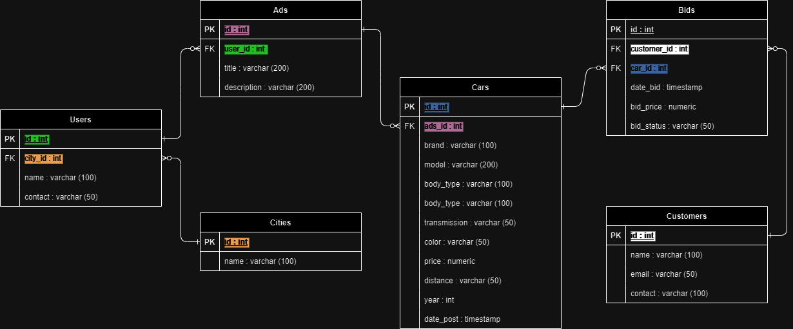
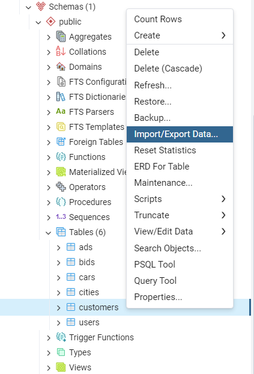
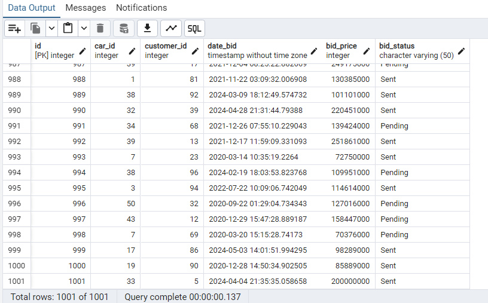
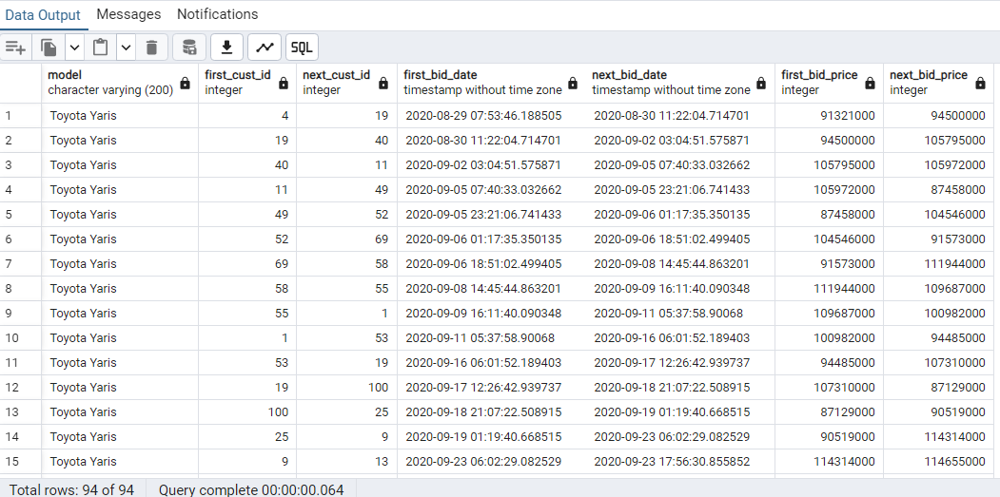

# Relational Database & SQL Project: Penjualan Mobil Bekas Online

## Objektif Project.
- Tujuan Utama: Membangun basis data relasional untuk website penjualan mobil bekas.
- Fitur Utama: Menyediakan fitur untuk pendaftaran pengguna, pengelolaan iklan, pencarian mobil, dan penawaran harga.
- Proses: Mendesain skema database, menginput data dummy, dan menganalisis data untuk memastikan fungsi dan efektivitas sistem.
- Cakupan Proyek: Fokus pada pengembangan database, bukan transaksi pembelian.

## Designing The Database:
-  Membuat  Struktur Tabel.
-  Tentukan fields dan keys untuk tiap tabel
-  Identifikasi Relasi

## ERD Penjualan Mobil Bekas Online


### Syntax DDL queries
```sql
CREATE TABLE cities(
	id INT PRIMARY KEY,
	name VARCHAR (100) NOT NULL
);

CREATE TABLE users(
	id SERIAL PRIMARY KEY,
	city_id INT NOT NULL,
	name VARCHAR (100) UNIQUE NOT NULL,
	contact VARCHAR (50) NOT NULL,
	CONSTRAINT fk_city_id
		FOREIGN KEY (city_id)
		REFERENCES cities(id)
);

CREATE TABLE customers(
	id SERIAL PRIMARY KEY,
	name VARCHAR (100) UNIQUE NOT NULL,
	email VARCHAR (50) NOT NULL,
	contact VARCHAR (100) NOT NULL
);

CREATE TABLE ads(
	id SERIAL PRIMARY KEY,
	user_id INT NOT NULL,
	title VARCHAR (200) NOT NULL,
	description TEXT DEFAULT 'No description',
	CONSTRAINT fk_user_id
		FOREIGN KEY (user_id)
		REFERENCES users(id)
);

CREATE TABLE cars(
	id SERIAL PRIMARY KEY,
	ads_id INT NOT NULL,
	brand VARCHAR (100) NOT NULL,
	model VARCHAR (200) NOT NULL,
	body_type VARCHAR (100) NOT NULL,
	transmission VARCHAR (50) NOT NULL,
	color VARCHAR (50)NOT NULL,
	price NUMERIC NOT NULL,
	distance VARCHAR (50) NOT NULL,
	years INT NOT NULL,
	date_post TIMESTAMP NOT NULL,
	CONSTRAINT fk_ads_id
		FOREIGN KEY (ads_id)
		REFERENCES ads(id)
);


CREATE TABLE bids(
	id SERIAL PRIMARY KEY, 
	customer_id INT NOT NULL,
	car_id INT NOT NULL,
	date_bid TIMESTAMP NOT NULL,
	bid_price INT NOT NULL,
	bid_status VARCHAR (50) NOT NULL,
	CONSTRAINT fk_customer_id
		FOREIGN KEY (customer_id)
		REFERENCES customers(id),
	CONSTRAINT fk_car_id
		FOREIGN KEY (car_id)
		REFERENCES cars(id)
);

SELECT * FROM customers
```

## Populating the database.
Kita akan menggunakan Faker di python untuk membuat data yang mirip seperti data asli. Sebagai contoh berikut generate data dummy untuk customers
```python
!pip install Faker
!pip install tabulate

# Import Library yang akan digunakan
from faker import Faker
from tabulate import tabulate

import csv

FAKER = Faker('id_ID')

"""# Membuat dummy data

### Dummy data customers
"""

def show_data(table):
  tab = tabulate(tabular_data=table, headers = table.keys(), tablefmt="psql", numalign = "center")
  print(tab)

def customers_table(n_cust, is_print):


  # Buat table
  table = {}
  table["id"] = [i+1 for i in range(n_cust)]
  table["name"] = [FAKER.name() for i in range(n_cust)]
  table["email"] = [FAKER.email() for i in range(n_cust)]
  table["kontak"] = [FAKER.numerify('+628##-####-####') for i in range(n_cust)]

  # Print table
  if is_print:
    show_data(table)

  return table

# membuat data table users
customers1_table = customers_table(100, True)
```

```python
"""# Simpan menjadi file csv"""

def save_to_csv(data, nama_file):

  # Membuat file csv
    with open(f'{nama_file}.csv', mode='w', newline='') as file:
        # Membuat writer csv
        writer = csv.writer(file)

        # write header csv
        writer.writerow(data.keys())

        # mengetahui panjang data
        len_Data = len(list(data.items())[0][1])

        # write data ke file csv
        for i in range(len_Data):
            row = []
            for key in data.keys():
                row.append(data[key][i])
            writer.writerow(row)

# menyimpan data customers dlm bentuk csv
save_to_csv(data = customers1_table,
            nama_file='customers')
```
### Input data ke dalam database menggunakan pgAdmin 4 



## Retrieve data
- Contoh transactional query
### Menambahkan satu data bid produk baru
```sql
INSERT INTO bids(car_id, customer_id, date_bid, bid_price, bid_status)
VALUES (33, 5, '2024-04-04 21:35:35.058658', 200000000, 'Sent')
``` 
```sql
ALTER SEQUENCE bids_id_seq RESTART WITH 1001
``` 	
```sql
SELECT 
  id,
  car_id,
  customer_id,
  date_bid,
  bid_price,
  bid_status
FROM bids
```



- Contoh analytical query
### Cari perbandingan tanggal customer yang melakukan bid dengan bid selanjutnya beserta harga tawar yang diberikan
```sql
WITH ranked_bids AS(
  SELECT
    model,
    customer_id,
    date_bid,
    bid_price
  FROM bids
  JOIN cars c on(car_id = c.id)
  WHERE model = 'Toyota Yaris'
)
SELECT 
  model,
  customer_id as first_cust_id,
  LEAD(customer_id) OVER(ORDER BY date_bid) as next_cust_id,
  date_bid as first_bid_date,
  LEAD(date_bid) OVER(ORDER BY date_bid) as next_bid_date,
  bid_price as first_bid_price,
  LEAD(bid_price) OVER(ORDER BY date_bid) as next_bid_price
FROM ranked_bids;
```


## DBMS yang digunakan:
PostgreSQL
